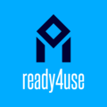

# ready4use 

## Readyforwhatsnext Methods for retrieving and managing data.

<!-- badges: start -->
[](https://www.tidyverse.org/lifecycle/#experimental)
<!-- badges: end -->

ready4use provides a set of classes and
methods for general data management tasks throughout the
readyforwhatsnext suite.

If you plan on testing this software you can install it by running the following commands in your R console:

```r
install.packages("devtools")

devtools::install_github("readyforwhatsnext/ready4use")

```
